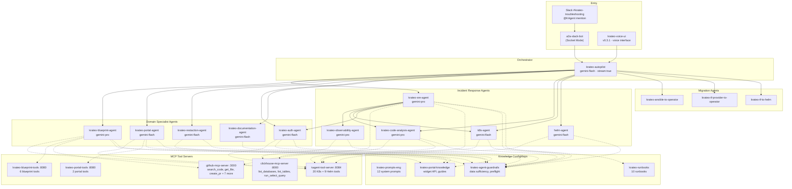
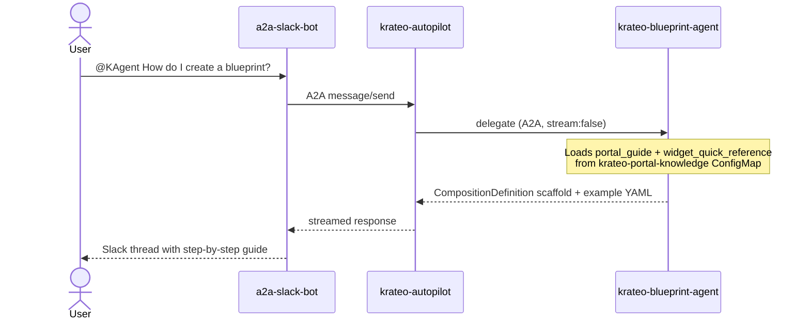
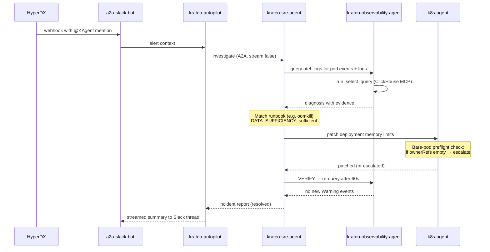
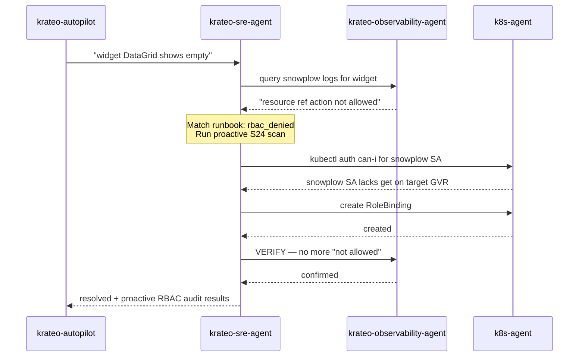
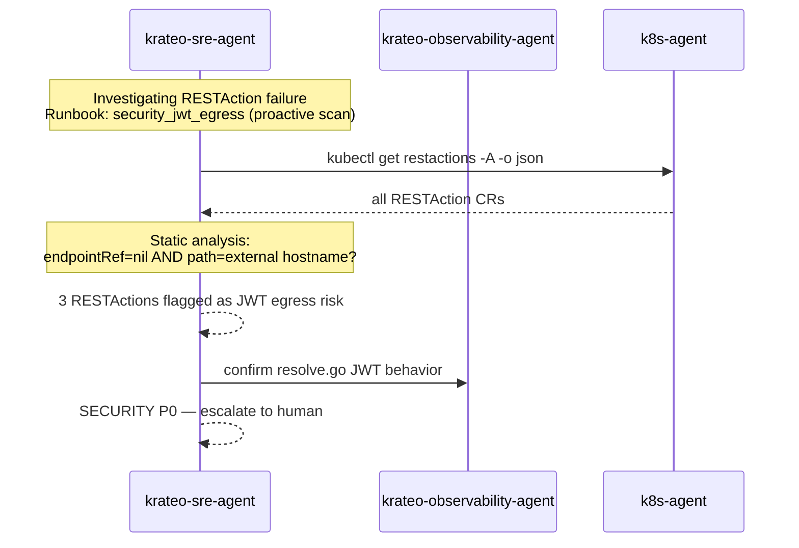
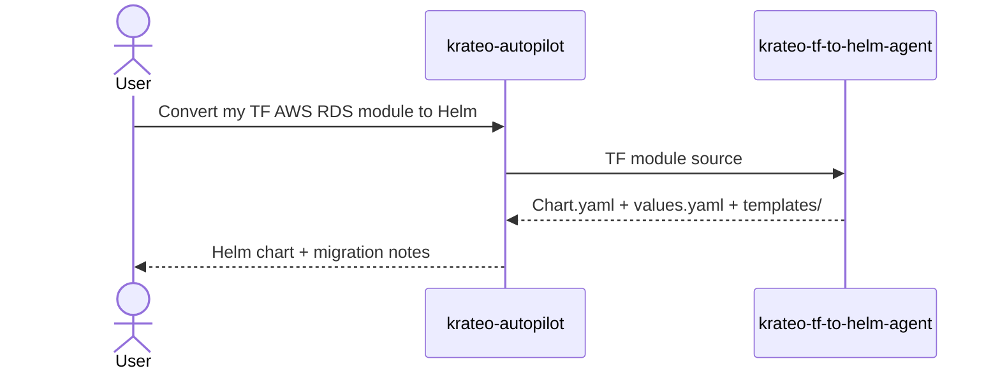

# Krateo Agent Ecosystem

**Date:** 2026-04-13
**Cluster:** gke_neon-481711_us-central1-a_cluster-1
**kagent:** v0.8.6 (CRD: kagent.dev/v1alpha2)
**Source:** Live cluster state via `kubectl get agents/remotemcpservers/configmaps -n krateo-system`

---

## 1. Overview

The Krateo agent ecosystem consists of **14 agents**, **5 MCP tool servers**, **4 knowledge ConfigMaps**, and **10 runbooks**, all deployed in the `krateo-system` namespace.

**Entry points:** Users interact with the Autopilot through two channels:
- **Slack** — `@KAgent` mentions in `#krateo-troubleshooting`. The `a2a-slack-bot` (Socket Mode) translates mentions into A2A calls. Also receives HyperDX alert webhooks.
- **Voice** — `krateo-voice-ui` (v0.3.1) at `35.238.240.27:8080`. Browser-based voice interface using Gemini speech-to-text/text-to-speech. Connects to the same Autopilot via A2A.

Both entry points route to `krateo-autopilot` via the kagent controller A2A API. Same agent chain, same routing, same sub-agents.

**Two operating modes:**
- **Adoption** — users ask how to build blueprints, configure widgets, set up auth → Autopilot routes to domain specialist agents
- **Incident response** — HyperDX alerts fire → Slack → Autopilot → SRE agent → closed-loop remediation with verification

> **Note on `agents/` directory:** The `agents/*.yaml` files in this repository are **reference designs** created during architecture planning. They use a different schema and model provider than what's deployed. The **live cluster state** (described in this document) is the source of truth. Post-deploy customizations are managed via `kagent-overrides/apply-overrides.sh`.

---

## 2. Architecture



---

## 3. Agent Roles

### Tier 1 — Orchestrator

| Agent | Model | Stream | Tools | Knowledge |
|-------|-------|--------|-------|-----------|
| **krateo-autopilot** | gemini-flash | true | kagent-tool-server (2 tools) + 13 Agent sub-tools | prompts |

Routes ALL user requests. **Only agent with `stream:true`** (for responsive Slack UX). All 13 sub-agents are `stream:false`. Cannot remediate directly — always delegates.

**Routing rules** (from system prompt):
- Alerts, incidents, troubleshooting → **krateo-sre-agent** (always, never self-diagnose)
- Auth questions → **krateo-auth-agent**
- Blueprint / CompositionDefinition → **krateo-blueprint-agent**
- Portal / widgets → **krateo-portal-agent**
- RESTAction configuration → **krateo-restaction-agent**
- Krateo concepts / architecture → **krateo-documentation-agent**
- K8s operations → **k8s-agent**
- Helm operations → **helm-agent**
- Source code tracing → **krateo-code-analysis-agent**
- Ansible / Terraform conversion → respective migration agent

### Tier 2 — Incident Response

| Agent | Model | Tools | Knowledge | Role |
|-------|-------|-------|-----------|------|
| **krateo-sre-agent** | gemini-pro | clickhouse-mcp (3), kagent-tools (1), sub-agents: observability, code-analysis, k8s, auth | 10 runbooks + guardrails | Alert triage, runbook-driven closed-loop: DIAGNOSE → CLASSIFY → ACT → VERIFY → REPORT |
| **krateo-observability-agent** | gemini-pro | clickhouse-mcp (3) | guardrails | ClickHouse queries: otel_logs, otel_metrics_gauge/sum/histogram, otel_traces. Also verifies remediation. |
| **k8s-agent** | gemini-flash | kagent-tools (20 K8s ops) | guardrails | READ-ONLY by default. Modifies only when explicitly asked. **Bare-pod preflight**: checks ownerReferences before delete. |
| **helm-agent** | gemini-flash | kagent-tools (9 Helm ops) | guardrails | GetRelease, Upgrade, Rollback, Uninstall, GetValues, GetHistory. |
| **krateo-code-analysis-agent** | gemini-pro | github-mcp (10), kagent-tools (3) | guardrails | Traces errors to GitHub source. Reads files, searches code, checks recent commits for regressions. |

### Tier 3 — Domain Specialists

| Agent | Model | Tools | Knowledge | Role |
|-------|-------|-------|-----------|------|
| **krateo-blueprint-agent** | gemini-pro | kagent-tools (3), blueprint-tools (6), github-mcp (7) | portal knowledge + guardrails | Creates CompositionDefinitions, generates Helm chart scaffolding, manages composition lifecycle. Can push to GitHub. |
| **krateo-portal-agent** | gemini-flash | kagent-tools (2), portal-tools (2) | widget_quick_reference, portal_guide, form_autocomplete, form_values, guides + guardrails | Widget CRD generation, page layout, form configuration, action wiring. Full widget API reference in knowledge. |
| **krateo-restaction-agent** | gemini-flash | None (prompt-only) | portal knowledge + guardrails | RESTAction CRD authoring: endpointRef Secrets, dependsOn DAGs, jq filter syntax (gojq dialect). |
| **krateo-auth-agent** | gemini-flash | kagent-tools (3) | portal knowledge + guardrails | Auth strategy CRDs: basic auth, LDAP, OIDC, OAuth 2.0, social login. Can read/create Secrets. |
| **krateo-documentation-agent** | gemini-flash | None | guardrails | Answers Krateo architecture and concept questions. No cluster access. |

### Tier 4 — Migration

| Agent | Model | Role |
|-------|-------|------|
| **krateo-ansible-to-operator-agent** | gemini-pro | Converts Ansible playbooks/roles to K8s Operator SDK operators |
| **krateo-tf-provider-to-operator-agent** | gemini-pro | Translates Terraform providers to K8s operators (ACK, Config Connector, Crossplane) |
| **krateo-tf-to-helm-agent** | gemini-pro | Converts Terraform modules to Helm charts with K8s-native resources |

---

## 4. Interaction Flows

### Flow 1: Adoption — "How do I create a blueprint?"



### Flow 2: Alert — Pod crash closed-loop remediation



> **Note:** `demo/scenario1-crashloop.yaml` deploys a bare Pod (no ownerReferences). The k8s-agent must hit the bare-pod preflight guardrail and escalate rather than delete.

### Flow 3: Widget shows no data — RBAC fix



### Flow 4: Security scan during RESTAction investigation



### Flow 5: Terraform → Helm conversion



---

## 5. Use Cases with Examples

| # | User prompt | Agents invoked | Tools called | Outcome | How to test |
|---|-------------|---------------|-------------|---------|-------------|
| 1 | "Why is my portal blank?" | autopilot → SRE → observability | run_select_query | Diagnosed snowplow OOM, restarted | `kubectl set resources deploy/snowplow --limits=memory=1Mi -n krateo-system` |
| 2 | "Create a blueprint for my microservice" | autopilot → blueprint | krateo-blueprint-tools, github-mcp | CompositionDefinition + Helm chart generated | Ask via Slack: "@KAgent create a blueprint for a Node.js app" |
| 3 | "Add a DataGrid showing pods" | autopilot → portal | krateo-portal-tools | Widget YAML + RESTAction YAML provided | Ask via Slack: "@KAgent how do I create a DataGrid widget?" |
| 4 | "Configure OIDC login" | autopilot → auth | k8s_apply_manifest | OIDC strategy CR created | Ask via Slack: "@KAgent how do I configure OIDC auth?" |
| 5 | "Why does my form submit fail?" | autopilot → SRE → observability → portal | run_select_query, portal-tools | submitActionId mismatch found | Deploy widget with wrong clickActionId |
| 6 | "Roll back the last Helm upgrade" | autopilot → helm | GetRelease, RollbackRelease | Rolled back, pods verified | `helm upgrade --set image.tag=nonexistent test-release chart/` |
| 7 | "Show me error trends" | autopilot → observability | run_select_query | Error count by hour for 24h | Ask via Slack: "@KAgent show error trends for last 24h" |
| 8 | "Convert this Ansible role to operator" | autopilot → ansible-to-operator | — | Operator scaffold generated | Ask via Slack with Ansible role URL |
| 9 | "Why can't user X see deployments?" | autopilot → SRE → observability → k8s | run_select_query, k8s_get_resources | Missing RoleBinding created | Remove a RoleBinding, then ask agent to diagnose |
| 10 | "Trace the snowplow panic" | autopilot → SRE → observability → code-analysis | run_select_query, github get_file_contents | Panic traced to resolve.go:427 | Trigger concurrent widget resolution under load |

---

## 6. Knowledge System

Knowledge is injected at agent startup via `spec.declarative.promptTemplate.dataSources` referencing ConfigMaps. The kagent template engine expands `{{include "alias/key"}}` directives in the system prompt.

| ConfigMap | Alias | Keys | Used by |
|-----------|-------|------|---------|
| **krateo-prompts-eng** | prompts | autopilot, sre_agent, observability_agent, portal_agent, restaction_agent, blueprint_agent, auth_agent, documentation_agent, code_analysis_agent, ansible_to_operator_agent, tf_provider_to_operator_agent, tf_to_helm_agent | All 14 agents |
| **krateo-runbooks** | runbooks | oomkill, helm_failure, restaction_failure, widget_failure, composition_failure, infra_self_healing, rbac_denied, security_jwt_egress, snowplow_panic, snowplow_bootstrap | krateo-sre-agent |
| **krateo-portal-knowledge** | knowledge | portal_guide, widget_quick_reference, form_autocomplete, form_values, guide_simple_page, guide_action_button | blueprint, portal, restaction, auth agents |
| **krateo-agent-guardrails** | guardrails | guardrails (single key with all rules) | All 10 sub-agents |

**To add new knowledge:** Add a key to the ConfigMap → add `{{include "alias/key"}}` to the agent's system prompt → restart the agent pod.

---

## 7. Guardrails

Loaded from `krateo-agent-guardrails` ConfigMap into all 10 sub-agents:

| Guardrail | Prevents | How it works |
|-----------|----------|--------------|
| **DATA_SUFFICIENCY** | LLM confabulation when tool calls return empty (Bug 5: agent inferred root cause from pod name, not data) | Agent must declare `DATA_SUFFICIENCY: sufficient/insufficient` before diagnosing. Empty results → `ROOT_CAUSE: unknown`. |
| **EMPTY SUB-AGENT RESPONSE** | Silent acceptance of `{'result': ''}` from A2A streaming bug (Bug 2) | Agent must flag empty responses as communication issues, retry once. |
| **BARE-POD PREFLIGHT** | Deleting bare pods that restart indefinitely (Bug 3: pod had no ownerReferences, delete just caused recreation) | k8s-agent checks `ownerReferences` before `delete_pod`. Empty → `BARE_POD_DETECTED`, escalate. |
| **ESCALATION TIMEOUT** | `ask_user` hanging forever with no human response (Bug 3 follow-up) | 15-minute cap, then `ESCALATION_TIMEOUT` + close. |

---

## 8. Runbooks

10 runbooks in `krateo-runbooks` ConfigMap, loaded by `krateo-sre-agent` via `{{include "runbooks/<name>"}}`:

| Runbook | Trigger | Delegates to | Proactive scan |
|---------|---------|-------------|----------------|
| **oomkill** | K8s event reason=OOMKilling | k8s-agent (patch limits) | — |
| **helm_failure** | Helm release status=failed | helm-agent (rollback) | — |
| **restaction_failure** | `unable to resolve api endpoint reference`, `api call response failure`, `unable to resolve filter`, `api not found in apiMap` | krateo-restaction-agent | — |
| **widget_failure** | `unable to resolve api reference`, `unable to resolve widgetDataTemplate`, `unable to resolve widget` | krateo-portal-agent | — |
| **composition_failure** | CompositionDefinition/Composition reconcile errors, chart fetch, Helm render | krateo-blueprint-agent | — |
| **infra_self_healing** | Observability stack components down (OTel, ClickHouse, MCP, HyperDX) | k8s-agent (rollout restart) | — |
| **rbac_denied** | Widgets render empty, `resource ref action not allowed`, `unable to get resource` + IsForbidden | k8s-agent (RoleBinding) | **S24**: snowplow SA self-check. **S17/S21**: per-RESTAction RBAC audit |
| **security_jwt_egress** | RESTAction with nil endpointRef + external URL (P0 SECURITY) | krateo-restaction-agent | **S31**: cluster-wide static scan of all RESTActions |
| **snowplow_panic** | Runtime panic / `concurrent map write` in snowplow logs | krateo-code-analysis-agent | — |
| **snowplow_bootstrap** | Snowplow pod CrashLoopBackOff on startup (redis, env vars, SA) | k8s-agent | — |

---

## 9. Measurement Hooks

Each interaction flow maps to ClickHouse-native metrics (from `otel_traces` and `otel_logs`):

| Flow | Metric | Query source |
|------|--------|-------------|
| Alert → remediation | **MTTR per runbook**: autopilot root span Duration grouped by alert_reason | `otel_traces WHERE ServiceName='krateo-autopilot' AND ParentSpanId=''` |
| Adoption guidance | **Turns to resolution**: count LLM request spans per TraceId. Target: median < 4. | `otel_traces` span count per trace |
| Adoption guidance | **Composition success rate**: did the composition reach Ready after agent help? | Join trace composition-id against K8s events |
| Adoption guidance | **Retry rate**: same user + composition within 1h = first answer didn't work | Session fingerprinting |
| SRE diagnosis | **Empty-result confabulation**: traces where observability-agent returned empty but SRE produced 200+ char diagnosis | `otel_traces` response length check |
| Streaming | **Streaming regression guard**: sub-agent spans with Duration < 500ms AND empty response | `otel_traces WHERE Duration < 5e8` |
| Escalation | **Escalation timeout rate**: `ask_user` spans with no follow-up within 15 min | `otel_traces` span sequence |

---

## 10. Operational Notes

### Streaming architecture

The Autopilot runs `stream:true` for responsive Slack UX. All 13 sub-agents run `stream:false`.

**Why:** A2A calls with `stream:true` return `{'result': ''}` immediately while the sub-agent continues running asynchronously. The Autopilot interprets the empty result as "done" and responds "I delegated, will update later" — but never follows up. Setting `stream:false` forces synchronous completion, returning the full response. This was an observed bug, not a design choice.

> **History:** The SRE agent's base prompt originally referenced `krateo-code-remediation-agent`, which doesn't exist. The actual agent is `krateo-code-analysis-agent`. This caused `Tool not found` errors on every MANIFEST_ERROR classification. Fixed via prompt patch in `kagent-overrides/prompts/sre_agent.md`.

### Post-redeploy procedure

After any kagent Helm upgrade:
```bash
./kagent-overrides/apply-overrides.sh
```
This script: (1) patches prompts ConfigMap, (2) deploys guardrails + knowledge + runbooks ConfigMaps, (3) wires dataSources into agents, (4) sets `stream:false` on sub-agents, (5) restarts all agent deployments.

### Adding a new agent

1. Create the Agent CRD YAML (`apiVersion: kagent.dev/v1alpha2`)
2. Add its system prompt key to `krateo-prompts-eng` ConfigMap
3. Add `guardrails` dataSource reference
4. Add it as an Agent tool in `krateo-autopilot`'s tools list
5. Apply all, restart autopilot to discover the new sub-agent
6. Update `apply-overrides.sh` to include the new prompt key

### Known gaps

- **Proactive monitoring agent** exists as a reference design (`agents/proactive-monitor-agent.yaml`) but is NOT deployed as a kagent Agent CRD. Proactive scans are embedded in runbooks (rbac_denied, security_jwt_egress) instead.
- **Adoption-mode quality feedback loop** does not exist. If a domain agent gives wrong guidance, there's no mechanism to detect or correct it beyond human observation.
